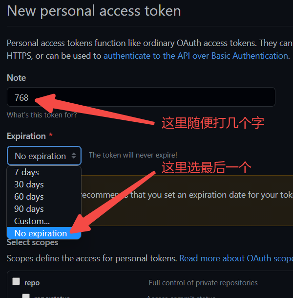

# jstar

## [项目主页](https://lnstow.github.io/jstar)

## 使用远程同步（可选功能）

1. [访问此页面](https://github.com/settings/tokens/new?scopes=gist)，然后 **登陆或注册** Github帐号
2. 按照图片步骤  
    

3. 滚动到页面底部，**点击绿色按钮**
4. 页面跳转后复制 token  
    
    
5. [打开项目主页](https://lnstow.github.io/jstar)，粘贴 token  
    

## 同步与分享
本项目的数据同步使用 Github Gist 来完成，需要一个 Github 帐号

1. Token(账号) 是用于同步数据的凭证，一个 Github 账号可以生成多个有效 Token，并且可以指定不同的过期时间，**请确保** 生成的 Token 具有 Gist 权限（使用步骤一中的链接）。在项目中修改 Token 后会自动创建（或使用已有） Gist 作为远程数据。

2. Gist(数据) 表示一个远程的数据仓库，在没有 Token 的情况下，使用 Gist 只能访问数据，只有使用有效的 Token 才能修改远程数据。所以单独分享 Gist 可以保证数据能访问而不会被修改

3. 分享功能是通过 链接参数 实现的。分享者可以点击菜单中的按钮生成链接，其他人需要访问分享链接，然后点击菜单，**远程下载**按钮即可获得数据
   - 分享账号（Token），建议只用于自己的账号多端同步，如果上传数据出现**账号错误**，请点击修改按钮覆盖本地账号
   - 分享数据（Gist），生成的链接可以随意分享，其他人需要点击**远程下载**获得数据，无法上传修改
   - 注意，在本地和链接中有账号/数据的情况下，优先使用的是链接，所以如果要使用本地账号/数据，请先删除链接中的参数（问号后面的文字）

### 底部菜单按钮
1. 远程上传（需要有 Token），使用 本地数据 **覆盖** 远程数据
2. 远程下载（只需有 Gist），使用 远程数据 **覆盖** 本地数据
3. 导入/导出，将本地数据保存成文件，或者从文件导入数据（覆盖）
4. 在输入框修改 Token 后，需要点击 **修改按钮** 才能生效
5. 鼠标悬浮（非长按）在 **帮助按钮** 一秒，可以分享Token、分享Gist、查看远程数据

## 浏览器跨域（CORS）扩展
当远程数据太多(>10MB)时，Gist 数据同步可能会发生 跨域请求，浏览器会禁止这种请求，导致数据无法下载，所以建议安装 **CORS扩展** 解除限制

[以此插件为例](https://chrome.google.com/webstore/detail/cross-domain-cors/mjhpgnbimicffchbodmgfnemoghjakai?hl=zh-CN)

